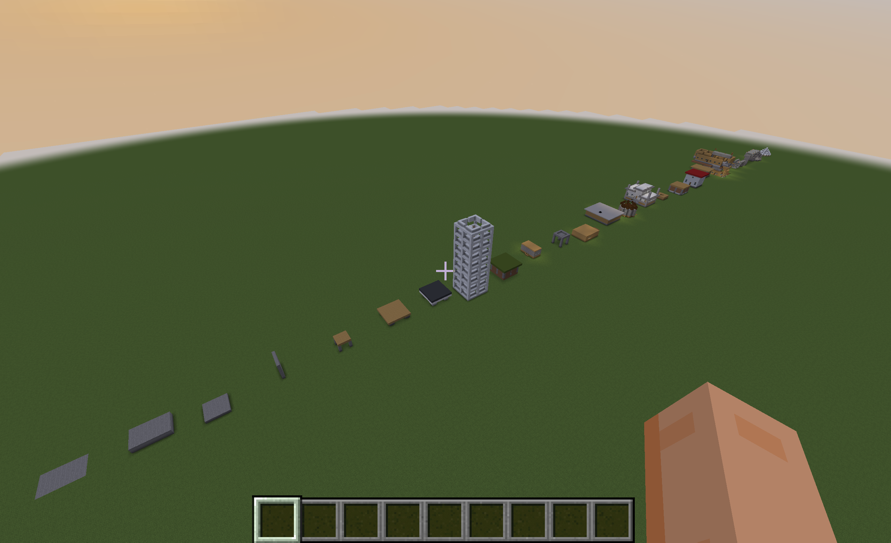

# MineCEraft

*Pronunciation: mine-see-ee-raft*

  

**MineCEraft** (Minecraft **C**onstruction **E**ngineering Benchmark) is an open-source benchmark for evaluating LLMs as construction engineers in Minecraft. It provides a safe, controllable environment to assess how well language models perform realistic construction engineering tasks with programmable and systematic evaluation.

Our work is located in the [mineCEraft](mineCEraft/) folder.

## Quick Start

### Requirements
- [Minecraft Java Edition](https://www.minecraft.net/en-us/store/minecraft-java-bedrock-edition-pc) (recommend v1.21.1)
- [Node.js](https://nodejs.org/) Installed
- Rename `keys.example.json` to `keys.json` and fill in API keys

### In Minecraft
(The world setup only needs to be done once; after that, you can just "Recreate" it.)
- Select Single Player
- In "Game" tab, Game Mode: Creative, Difficulty: Peaceful, Allow Commands: ON
- In "World" tab, World Type: Superflat
- In "Customize" (Superflat Customization), Presets = `minecraft:bedrock,62*minecraft:dirt,minecraft:grass_block;minecraft:plains`
- In "More" tab, toggle off (1) time advance and (2) weather.
- "Create New World"
- Click ESC and "Open to LAN" (Port Num: 55916)

### In Code
- Check if `random_seed` and `model` in [builder.json](builder.json) are set correctly.
- Check if `sampling_for_lite` is set correctly in [main.ipynb](mineCEraft/main.ipynb)
- "Restart" and "Run all" [main.ipynb](mineCEraft/main.ipynb)

## Benchmark Categories

Benchmark files under `mineCEraft/benchmarks/` use the following prefixes:

| Prefix  | Meaning |
|---------|---------|
| `1-se`  | Structural Elements |
| `2-bt`  | Building Types |
| `3-ae`  | Architectural Element |
| `4-cm`  | Construction Management |
| `5-ce`  | Civil Engineering |

Subcategories:

- **Structural Elements**: Foundations, Walls, Roofs and Columns, Frames
- **Building Types**: Basic Buildings, Multiple Rooms, Multiple Bedrooms, Multi-story Building
- **Architectural Element**: Accessibility, Creative Requests
- **Construction Management**: Resource Optimization, Single-turn Planning, Multi-turn Planning & Revision
- **Civil Engineering**: Basic Bridges, Arched Bridges, Dome

## Workflow

`main.ipynb` loads prompts from `benchmarks/*.json`, sends them to the builder agent via `send_prompts.js`, extracts block placements from the generated action code using `action_processor.py`, and evaluates them with `eval_code/`.

## Key Files

| File | Purpose |
|------|---------|
| `main.ipynb` | End-to-end benchmark run and evaluation |
| `builder.json` | Builder agent profile (referenced by `settings.js`) |
| `category.json` | Evaluation categories: accuracy, safety, planning |
| `samples/` | Example JS action files for manual evaluation |

We provide test notebooks for each evaluation module. They serve as documentation, clarify how each criterion is assessed, and support maintainability. See the notebooks below (by category):

| Category | Test notebooks |
|----------|----------------|
| **accuracy** | [material](mineCEraft/eval_code/material_test.ipynb), [shape](mineCEraft/eval_code/shape_test.ipynb), [size](mineCEraft/eval_code/size_test.ipynb) |
| **safety** | [physical_plausibility](mineCEraft/eval_code/physical_plausibility_test.ipynb), [structural_stability](mineCEraft/eval_code/structural_stability_test.ipynb) |
| **planning** | [efficiency](mineCEraft/eval_code/efficiency_test.ipynb), [dependency](mineCEraft/eval_code/dependency_test.ipynb) |
| other | [integrated](mineCEraft/eval_code/_integrated_test.ipynb) |

---

## Acknowledgement

This project is built on [Mindcraft](https://github.com/mindcraft-bots/mindcraft) (Paper: https://arxiv.org/pdf/2504.17950). We thank the Mindcraft project for the underlying framework. For setup, installation, and detailed documentation, please also refer to [github.com/mindcraft-bots/mindcraft](https://github.com/mindcraft-bots/mindcraft).
